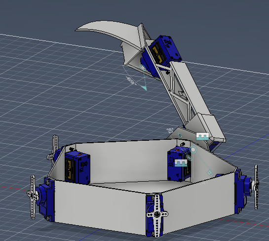

# Inverted Pentapod

## What is this?
This is an inverted pentapod that contains 15 Tower Pro SG90 motors powered by a Gens Ace 3s 2200mA Lipo battery and controlled by an ESP32-WROOM-32. It's designed to look like Mark Setrakian's Axis 2 robot (featured on Battlebots). The base has a radius of 63.44mm, and the top has a radius of ~144mm. As this is a lower budget than my inspiration, the weight that this can hold is significantly smaller, and the size, too. It also does not have the auto-reset tool that Mark's does, sadly. The legs "crawl" around a circle, which in essence rotates the circle. Each leg has 3 axis of rotation(one to rotate left/right, and 2 that both help move up/down and out/in). 

## Why did i make this?
THis was made because I thought that making an overcomplicated system of showing off another (non-hardware but still physical) project woudl be a great idea!. Also, looking at how to make this was a challange (at least to me), because the scope wes so big. I had to:
1.  come up with a way to implement reverse kinematics (while also making sure that my numbers were correct), best shown on my [desmos](https://www.desmos.com/3d/bab8vpf2qy)(use t slider to play). This was great for applying newfound dlinear algebra techniques to map out data, and use sinosudal identities to find end angles (also more precalculus math(fun!))
2. learn how to power high-ish amperage systems
3. improve my CAD design and learn how to use Fusion simulators 

This was a steep-ish learning curve, but very interesting! I learned what a wire nut is!

## Library
### general schematic

### General overview (there's supposed to be 5 legs but I'm scared that having more than 1 will significantly slow down Fusion)

### Pentapod with top

### top part of leg

### middle part of leg

### bottom part of middle leg

### base

### BOM
| **mfg name** | **Description**                                                | **Unit price** | **quantity** | **Price** | **shipping** | **total** | **link**                                                                                                                                |
|--------------|----------------------------------------------------------------|----------------|--------------|-----------|--------------|-----------|------------------------------------------------------------------------------------------------------------------------------------------|
| HOME DEPOT   | (By-the-Foot) 18/2 Brown Solid CU CL2 Thermostat Wire          | $0.26          | 6            | $1.56     |              | $1.56     | https://www.homedepot.com/p/Southwire-By-the-Foot-18-2-Brown-Solid-CU-CL2-Thermostat-Wire-64162199/204632887                             |
| HOME DEPOT   | wire nuts                                                      | $5.42          | 1            | $5.42     |              | $5.42     | https://www.homedepot.com/p/Commercial-Electric-Standard-Wire-Connector-Assortment-30-Pack-ESA-30/315849553                              |
| HOME DEPOT   | shipping, taxes, tariffs                                       |                |              | $0.00     | $0.00        | $0.00     |                                                                                                                                          |
| TINYSINE     | tower pro sg90 motor                                           | $1.90          | 16           | $30.40    |              | $30.40    | https://www.tinyosshop.com/sg90-micro-servo?filter_name=sg90&filter_description=true&filter_sub_category=true                            |
| TINYSINE     | shipping, taxes, tariffs                                       |                |              |           | $12.00       |           |                                                                                                                                          |
| BUDDY RC     | XT60 Male Connectors for Charger                               | $3.49          | 1            | $3.49     |              | $3.49     | https://www.buddyrc.com/products/xt60-device-kit-charger-side-4-pcs?variant=44442952564974                                               |
| BUDDY RC     |  Tattu 1300mAh 45C 3S1P 11.1V Lipo Battery Pack with XT60 plug | $16.49         | 2            | $32.98    |              | $32.98    | https://www.buddyrc.com/products/gens-ace-bashing-11-1v-2200mah-35c-3s1p-g-tech-lipo-battery-pack-with-xt60-plug?variant=44339949142254  |
| BUDDY RC     | voltage checker/alarm                                          | $4.49          | 2            | $8.98     |              | $8.98     | https://www.buddyrc.com/products/aok-digital-voltage-checker-and-alarm?variant=30735569715286                                            |
| BUDDY RC     | mini charger(psu not included)                                 | $24.99         | 1            | $24.99    |              | $24.99    | https://www.buddyrc.com/products/gens-ace-imars-mini-g-tech-60w-rc-battery-charger-eco-friendly-version?variant=44104142782702           |
| BUDDY RC     | ztw 6a UBEC                                                    | $14.99         | 2            | $29.98    |              | $29.98    | https://www.buddyrc.com/products/ztw-6a-ubec?variant=30274461466710                                                                      |
| BUDDY RC     | shipping, taxes, tariffs                                       |                |              | $0.00     |              | $0.00     |                                                                                                                                          |

Subtotal: $137.80  
shipping: $12.00 
Total: $149.80 